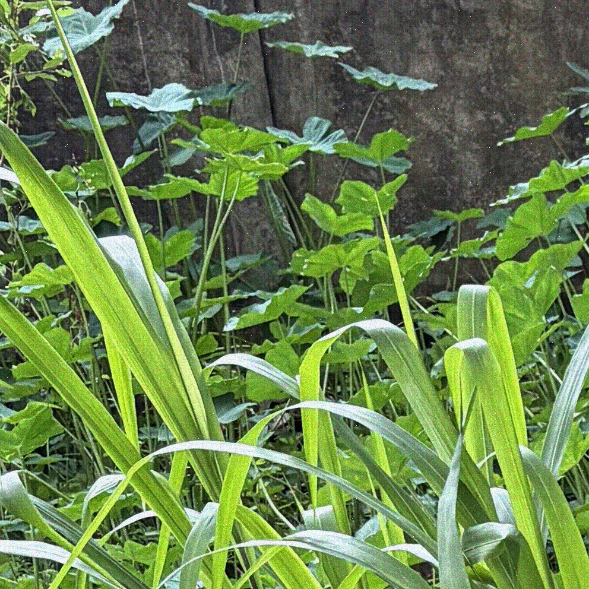
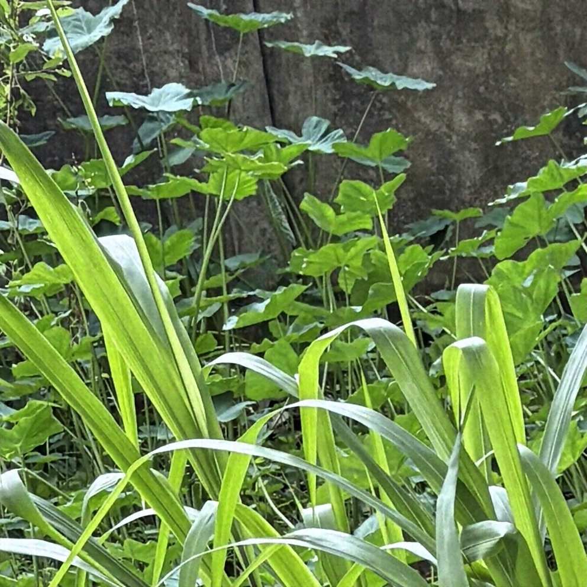
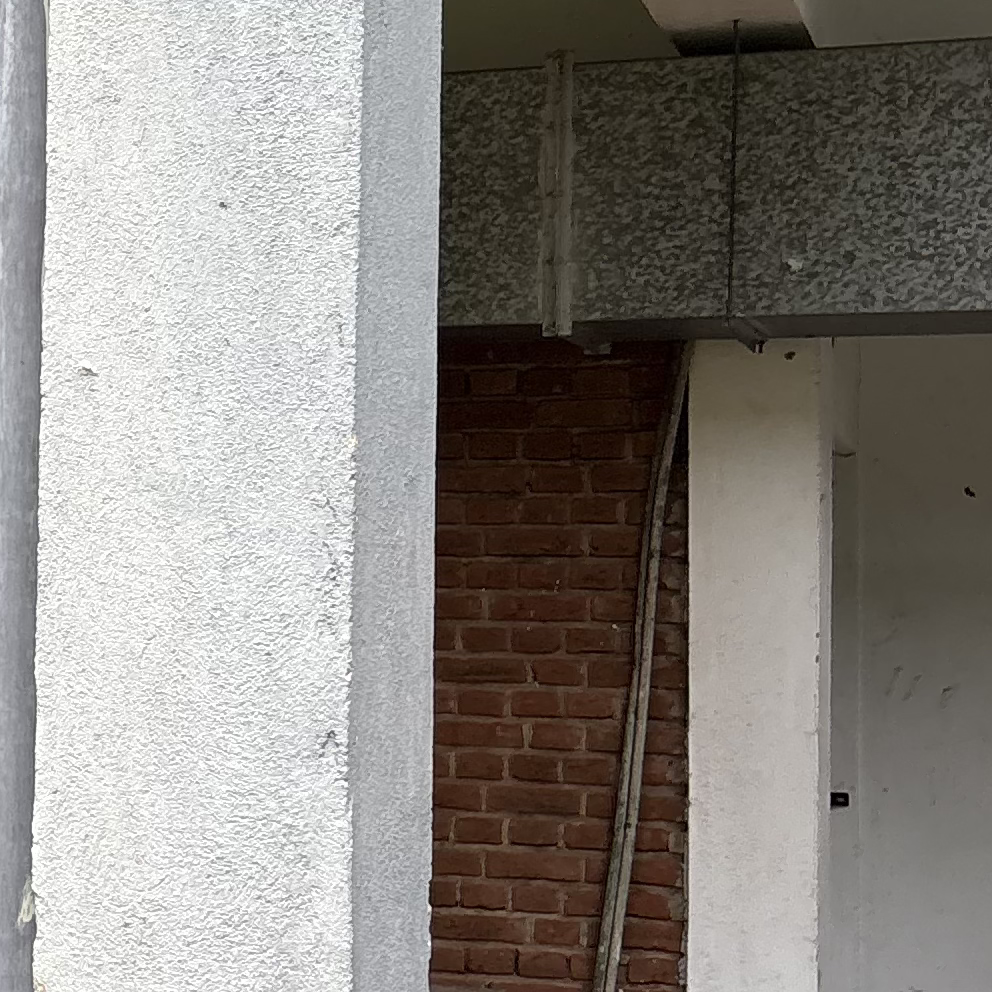

# Mora SP Cup 2026 – Low-Light Image Denoising

A signal-aware hybrid image restoration pipeline developed for the **Mora SP Cup 2026 Low-Light Image Denoising and Enhancement Challenge**.

The final solution combines:

- Residual **DnCNN**
- Robust **Charbonnier-loss fine-tuning**
- Classical **Wavelet denoising**
- Signal-dependent noise characterization
- Noisy-image noise-severity estimation
- Severity-aware adaptive fusion

The complete inference pipeline operates using **only the noisy input image**.  
Ground-truth images are not required during test-time inference.

<table align="center">
  <tr>
    <th>Noisy Input</th>
    <th>Final Denoised Output</th>
    <th>Ground Truth</th>
  </tr>
  <tr>
    <td>
      
    </td>
    <td>
      
    </td>
    <td>
      
    </td>
  </tr>
</table>

---

## Final Method

The final restoration pipeline is:

```text
                         Noisy RGB Image
                               |
                  +------------+------------+
                  |                         |
                  v                         v
          Robust DnCNN              Wavelet Denoising
                  |                         |
                  |                         |
                  |                  Noise Feature
                  |                    Extraction
                  |                         |
                  |                         v
                  |                 Severity Estimator
                  |                         |
                  |                 Low / Medium / High
                  |                         |
                  +------------+------------+
                               |
                               v
                    Severity-Aware Fusion
                               |
                               v
                    Final Denoised Image
```

The final estimate is

$$
\hat{x} = \alpha D(y) + (1-\alpha)W(y)
$$

where:

- $y$ is the noisy input
- $D(y)$ is the Robust DnCNN output
- $W(y)$ is the Wavelet output
- $\alpha$ depends on the estimated noise severity

### Adaptive Fusion Weights

| Predicted Severity | Robust DnCNN | Wavelet |
|---|---:|---:|
| Low | 0.85 | 0.15 |
| Medium | 0.90 | 0.10 |
| High | 0.90 | 0.10 |

---

# Performance

The final packaged inference pipeline was evaluated using the **organizer-provided evaluation script** on the held-out 92-image validation split.

| Metric | Final Result |
|---|---:|
| Mean PSNR | **28.9200 dB** |
| Mean SSIM | **0.844666** |
| Mean ΔPSNR | **+9.0401 dB** |
| Mean ΔSSIM | **+0.398515** |
| Composite Score | **0.52100917** |

Evaluation across all 460 public images gave:

| Metric | Result |
|---|---:|
| Mean PSNR | 28.7612 dB |
| Mean SSIM | 0.853272 |
| Mean ΔPSNR | +8.9355 dB |
| Mean ΔSSIM | +0.388888 |
| Composite Score | **0.51297707** |

> The 460-image result includes images used during model development.  
> The 92-image result is therefore used as the held-out validation result.

---

## Method Development

The final pipeline was developed progressively rather than treating the restoration problem as a black-box neural-network task.

### 1. Noise Characterization

Residual noise was defined as


$$
r = y-x
$$


where $y$ is the noisy image and $x$ is the corresponding clean image.

Analysis of the public paired dataset showed that the corruption was not well described by simple additive white Gaussian noise.

The main observations were:

- noise variance depends strongly on image intensity
- residual mean also changes with image intensity
- standardized residuals contain heavy tails
- strong residual outliers remain after variance normalization
- blue-channel residuals show particularly strong non-Gaussian behaviour
- image-level noise severity varies considerably between samples

Intensity-dependent bias and variance models were therefore estimated separately for the RGB channels.

A simplified noise model can be expressed as


$$
y_{i,c} = x_{i,c} + b_c(x) + s_i\sigma_c(x)\epsilon_{i,c}
$$

where:

- $b_c(x)$ represents intensity-dependent bias
- $\sigma_c(x)$ represents signal-dependent noise scale
- $s_i$ represents image-level noise severity
- $\epsilon_{i,c}$ represents standardized residual behaviour

---

### 2. Classical DSP Baseline Improvement

Several classical restoration approaches were evaluated.

The optimized Wavelet configuration was:

```text
Wavelet          : Symlet-4
Decomposition    : Level 4
Threshold method : BayesShrink
Threshold mode   : Soft
```

This classical branch is retained in the final model because it provides complementary information to the learned denoiser.

BM3D was also evaluated and produced strong restoration quality, but its runtime was significantly larger than the selected Wavelet approach.

---

### 3. Residual DnCNN

A 17-layer residual DnCNN was trained to predict the image noise residual.

Instead of predicting the clean image directly,

$$
\hat{r}=F(y)
$$

and the reconstructed image is


$$
\hat{x}=y-\hat{r}.
$$

The original model was trained using mean squared error.

---

### 4. Robust Charbonnier Fine-Tuning

Noise analysis showed substantial heavy-tailed residual behaviour.

To reduce the influence of strong residual outliers, the best MSE-trained DnCNN checkpoint was fine-tuned using Charbonnier loss:

$$
L_{\text{Charbonnier}} = \sqrt{(\hat{r}-r)^2+\epsilon^2}.
$$

This produced a large improvement over the original DnCNN.

| Method | Validation Composite Score |
|---|---:|
| Optimized Wavelet | ~0.353 |
| Original DnCNN | 0.435733 |
| Original DnCNN + Wavelet | 0.457151 |
| Robust Charbonnier DnCNN | 0.517096 |
| **Severity-Aware Adaptive Fusion** | **0.521009** |

---

### 5. Noise-Severity Estimation

Ground-truth-derived severity cannot be calculated for hidden test images.

Therefore, a test-time severity estimator was developed using only the noisy image and its Wavelet estimate.

For a Wavelet estimate $W$,

$$
r_W = y-W
$$

is used as an approximate residual.

For each colour channel, the residual is standardized using the fitted signal-dependent statistics:

$$
z_c = \frac{r_{W,c}-b_c(W_c)}{\sqrt{v_c(W_c)}}.
$$

Features include:

- MAD-based robust scale
- mean absolute standardized residual
- 90th percentile magnitude
- 95th percentile magnitude
- strong positive-tail fraction
- strong negative-tail fraction

A regression model maps these features to estimated image-level noise severity.

On the held-out validation split:

| Severity Estimation Metric | Result |
|---|---:|
| Pearson Correlation | **0.9883** |
| MAE | **0.0294** |
| RMSE | **0.0351** |
| $R^2$ | **0.9764** |
| Low / Medium / High Group Accuracy | **100%** |

The reported group accuracy refers specifically to the internal 92-image validation split.

---

# Repository Structure

The exact structure may contain additional experimental files, but the main submission components are organized as follows:

```text
.
├── README.md
│
├── assets/
│   ├── example_noisy.png
│   ├── example_denoised.png
│   └── example_ground_truth.png
│
├── baseline/
│   ├── denoise.py
│   ├── requirements.txt
│   └── README.md
│
├── Competition repo/
│   └──organizers' repository
│
├── competition_data/
│   └── submissions/
│       ├── noisy/
│       └── denoised/
│
├── evaluation/
│   └── evaluate.py
│
└── scripts/
    ├── denoise.py
    ├── dncnn_model.py
    ├── best_robust_dncnn.pth
    ├── severity_estimator.joblib
    ├── requirements.txt
    ├── README.md
    └── testings/
        └── experimental and development files

```

The `scripts/` directory contains everything required for final inference.

More detailed implementation information is available in:

```text
scripts/README.md
```

---

# Installation

## 1. Clone the Repository

```bash
git clone <repository-url>
cd <repository-folder>
```

Replace `<repository-url>` with the actual repository URL.

---

## 2. Create a Virtual Environment

Using Python's built-in `venv`:

### Windows

```powershell
python -m venv .venv
.\.venv\Scripts\activate
```

### Linux / macOS

```bash
python3 -m venv .venv
source .venv/bin/activate
```

---

## 3. Upgrade pip

```bash
python -m pip install --upgrade pip
```

---

## Install Dependencies

Install the required packages using:

```bash
pip install -r scripts/requirements.txt

The main runtime dependencies are:

```text
numpy==2.4.6
Pillow==12.3.0
opencv-python==5.0.0.93
torch==2.5.1
scikit-image==0.26.0
scikit-learn==1.9.1
joblib==1.6.0
```

If installing manually:

```bash
pip install numpy Pillow opencv-python torch scikit-image scikit-learn joblib
```

> PyTorch CUDA installation may depend on the CUDA version available on the target system.  
> The inference script also supports CPU execution.

---

# Inference

The main inference entry point is:

```text
scripts/denoise.py
```

Run the script from the repository root.

```bash
python scripts/denoise.py \
    --noise_dir competition_data/submissions/noisy \
    --denoised_dir competition_data/submissions/denoised
```

On Windows PowerShell, the same command can be written as:

```powershell
python .\scripts\denoise.py --noise_dir ".\competition_data\submissions\noisy" --denoised_dir ".\competition_data\submissions\denoised"
```

---

## Device Selection

By default, the program automatically selects CUDA when available.

```bash
--device auto
```

### Force GPU

```bash
python scripts/denoise.py \
    --noise_dir competition_data/submissions/noisy \
    --denoised_dir competition_data/submissions/denoised \
    --device cuda
```

### Force CPU

```bash
python scripts/denoise.py \
    --noise_dir competition_data/submissions/noisy \
    --denoised_dir competition_data/submissions/denoised \
    --device cpu
```

If no compatible CUDA device is available, `auto` automatically falls back to CPU.

---

# Input and Output Format

Input images use the competition naming convention:

```text
461_noise.png
462_noise.png
463_noise.png
...
```

The inference script automatically removes the `_noise` suffix.

Outputs are therefore written as:

```text
461.png
462.png
463.png
...
```

Images are saved as RGB PNG files.

---

# Example

Input:

```text
competition_data/submissions/noisy/
├── 461_noise.png
├── 462_noise.png
├── 463_noise.png
└── ...
```

Run:

```powershell
python .\scripts\denoise.py --noise_dir ".\competition_data\submissions\noisy" --denoised_dir ".\competition_data\submissions\denoised"
```

Output:

```text
competition_data/submissions/denoised/
├── 461.png
├── 462.png
├── 463.png
└── ...
```

The script also prints the estimated severity group and selected adaptive fusion weight for each image.

Example:

```text
[01/20] 461_noise.png -> 461.png | severity=0.8731 | group=Medium | DnCNN=0.90 | Wavelet=0.10
```

---

# Evaluation

The organizer-provided evaluator can be used on public data.

Example:

```bash
python evaluation/evaluate.py \
    --noisy_dir competition_data/public/noisy \
    --pred_dir competition_data/public/denoised \
    --gt_dir competition_data/public/ground_truth
```

On Windows PowerShell:

```powershell
python .\evaluation\evaluate.py --noisy_dir ".\competition_data\public\noisy" --pred_dir ".\competition_data\public\denoised" --gt_dir ".\competition_data\public\ground_truth"
```

The evaluator reports:

- PSNR
- SSIM
- ΔPSNR
- ΔSSIM
- Composite Score

---

# Runtime

Runtime was measured on the same 20 preliminary images (`461–480`) using the final packaged inference pipeline.

| Inference Mode | Images | Average Runtime / Image | Total Runtime |
|---|---:|---:|---:|
| CUDA-accelerated | 20 | **0.699 s** | **16.38 s** |
| CPU-only | 20 | **6.211 s** | **126.58 s** |

The CUDA-accelerated measurement uses the GPU for DnCNN inference, while the Wavelet denoising, noise-severity estimation, adaptive fusion, and image I/O remain part of the complete end-to-end pipeline.
# Model Files

## `best_robust_dncnn.pth`

Contains the final Robust DnCNN parameters.

The checkpoint was obtained by fine-tuning the strongest MSE-trained model using Charbonnier loss.

---

## `severity_estimator.joblib`

Contains the trained noise-severity regression pipeline.

It predicts continuous image-level severity using residual features derived entirely from the noisy image and Wavelet estimate.

No ground truth is required.

---

# Offline Execution

The final inference pipeline is completely offline.

It does not:

- access the internet
- download weights
- call external APIs
- require ground-truth images
- fetch external model files at runtime

All model files required for inference are included in `scripts/`.

---

# Reproducibility

The inference process is deterministic.

During final inference:

- DnCNN is placed in evaluation mode
- gradients are disabled
- no random cropping is performed
- no augmentation is performed
- severity thresholds are fixed
- adaptive fusion weights are fixed
- all required model weights are local

---

# Final Validation Reproduction

The final packaged `scripts/denoise.py` was run independently on the public images.

The resulting outputs were then evaluated using the organizer-provided evaluator on the exact held-out 92-image validation subset.

```text
==============================================
EVALUATION COMPLETE
==============================================
Images scored:      92
Mean PSNR:           28.9200 dB
Mean SSIM:           0.844666
Mean Delta PSNR:     +9.0401 dB
Mean Delta SSIM:     +0.398515

Composite Score:     0.52100917
==============================================
```

This verifies that the packaged submission pipeline reproduces the selected validation method.

---

# Key Design Decisions

The final design was selected based on controlled experiments rather than using the most computationally complex method.

**Wavelet denoising** provided an efficient classical DSP restoration branch.

**BM3D** produced strong results but required substantially more processing time.

**DnCNN** provided significantly stronger restoration than classical methods.

**Charbonnier fine-tuning** was motivated by the heavy-tailed residual noise observed during characterization.

**Adaptive fusion** improved over both fixed DnCNN/Wavelet fusion and Robust DnCNN alone.

This produced the final sequence:

```text
Noise Characterization
        ↓
Classical DSP Exploration
        ↓
Residual DnCNN
        ↓
Heavy-Tail Analysis
        ↓
Charbonnier Fine-Tuning
        ↓
Noisy-Only Severity Estimation
        ↓
Severity-Aware Adaptive Fusion
        ↓
Final Submission Pipeline
```

---

# Notes

- The final test-time algorithm does not use ground truth.
- Signal-dependent noise parameters were estimated during development from the public paired dataset.
- The validation scores reported above should be interpreted as internal development/validation results rather than hidden-test scores.
- The final hidden-set performance can only be determined by the competition evaluator.

---

# Technical Details

For a more detailed description of:

- DnCNN architecture
- Wavelet configuration
- severity estimation
- adaptive fusion
- model files
- inference implementation

see:

```text
scripts/README.md
```

---

# Requirements Summary

Minimum required Python packages:

```text
numpy
Pillow
opencv-python
torch
scikit-image
scikit-learn
joblib
```

A compatible Python 3 environment is required.

---

# Competition

**Mora SP Cup 2026**  
Low-Light Image Denoising and Enhancement Challenge

---

## Final Submission Method

**Noise-Severity-Aware Robust DnCNN + Wavelet Adaptive Fusion**

Held-out validation composite score:

$$
\boxed{0.52100917}
$$
